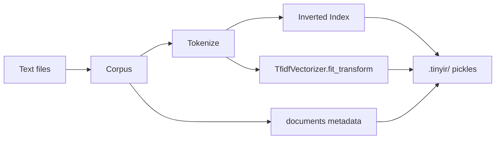
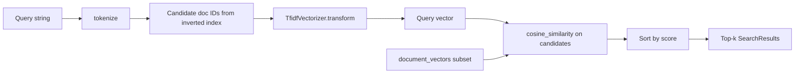

# TinyIR Design

Architecture and data flow for the TinyIR library and CLI.

## Architecture

Small Python library with a Click CLI. Each module handles one pipeline stage. No shared runtime or database.

```
┌─────────────┐
│   cli.py    │  index, search commands
└──────┬──────┘
       │
       ▼
┌─────────────┐     ┌──────────────┐
│  corpus.py  │────▶│ tokenize.py  │
│  Document   │     │  tokenize()  │
│  Corpus     │     └──────┬───────┘
└──────┬──────┘            │
       │                   │
       ▼                   ▼
┌─────────────────────────────────┐
│           index.py              │
│  InvertedIndex                  │
│  - inverted_index (postings)    │
│  - TfidfVectorizer              │
│  - document_vectors             │
│  - save() / load() -> .tinyir/  │
└──────────────┬──────────────────┘
               │
               ▼
        ┌─────────────┐
        │   rank.py   │
        │  rank()     │
        └─────────────┘
```

### Modules

| Module        | Role                                                                    |
| ------------- | ----------------------------------------------------------------------- |
| `corpus.py`   | Load `*.txt` files, skip invalid UTF-8 with a warning, assign `doc_id`, expose `Document` records. |
| `tokenize.py` | Lowercase, strip punctuation, split tokens; optional stopwords.         |
| `index.py`    | Build inverted index and TF-IDF vectors; save/load pickles.             |
| `rank.py`     | Vectorize query, cosine similarity, return top-`k` `SearchResult` list. |
| `cli.py`      | `tinyir index` and `tinyir search`.                                     |

### Data structures

- `Document`: `doc_id`, `filename`, `path`, `text` (frozen dataclass).
- **Inverted index**: `dict[str, list[tuple[int, int]]]` (term -> `(doc_id, term_freq)` postings).
- **TF-IDF**: fitted `TfidfVectorizer` plus sparse `document_vectors` from `fit_transform()`.
- `SearchResult`: `doc_id`, `filename`, `path`, `score`.

### Persistence

Indexing writes four pickle files under `.tinyir/` (or `-o` path):

| File                 | Contents                                             |
| -------------------- | ---------------------------------------------------- |
| `tfidf_model.pkl`    | vectorizer, document matrix, `remove_stopwords` flag |
| `vocabulary.pkl`     | term -> column index                                 |
| `inverted_index.pkl` | term -> `(doc_id, term_freq)` postings               |
| `documents.pkl`      | `doc_id`, `filename`, `path`                         |

`InvertedIndex.load()` restores all four artifacts for search.

## Data flow

### Index (`tinyir index <folder>`)

1. `Corpus` loads sorted `*.txt` files, skips files that are not valid UTF-8, and assigns sequential `doc_id` values only to files that load.
2. Each document is tokenized once (optional stopword filter).
3. Term frequencies populate inverted-index postings lists.
4. `TfidfVectorizer.fit_transform()` fits the model on tokenized text and produces the vocabulary and TF-IDF document matrix. Search later reuses the saved vectorizer with `transform()` only (see search flow below).
5. `save()` writes pickles, including `inverted_index.pkl`.



### Search (`tinyir search "<query>"`)

1. `InvertedIndex.load()` reads pickles.
2. Query is tokenized with the same stopword setting as the index.
3. Postings lists yield a candidate document set (union of query terms).
4. `cosine_similarity` scores only candidate document vectors.
5. Top `k` indices map back to `doc_id`, filename, and similarity score for display.



### Constraints

- In-memory vectors; aimed at small corpora (roughly 10-100 short files).
- Documents and queries are tokenized with `tokenize()` before vectorization (`analyzer=str.split`).
- Local only: scikit-learn + stdlib, no external services.

Expected performance on small corpora: indexing under ~1s, queries under ~50ms, memory under ~100MB.

## Future plans

Current release is CLI-only. Library code is separate from `cli.py` so other entry points can reuse it.

#### FastAPI API (optional)

Thin HTTP wrapper around existing functions:

- `POST /index`: build index from corpus path or uploads
- `GET /search?q=...&k=...`: return ranked JSON results

Request handling and JSON serialization live in FastAPI; `InvertedIndex`, `rank()`, and pickle I/O stay as-is.

#### Web UI (optional)

Simple HTML/JS or React front end on top of the API: search box, result list, optional rebuild controls. No retrieval logic in the browser.

#### Other ideas

- BM25 as an alternative ranker
- Phrase and proximity queries
- Result snippets
- Stemming/lemmatization in the tokenizer
